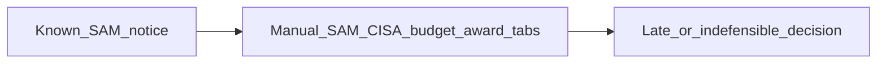
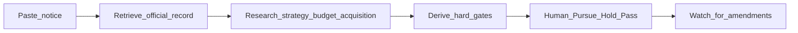
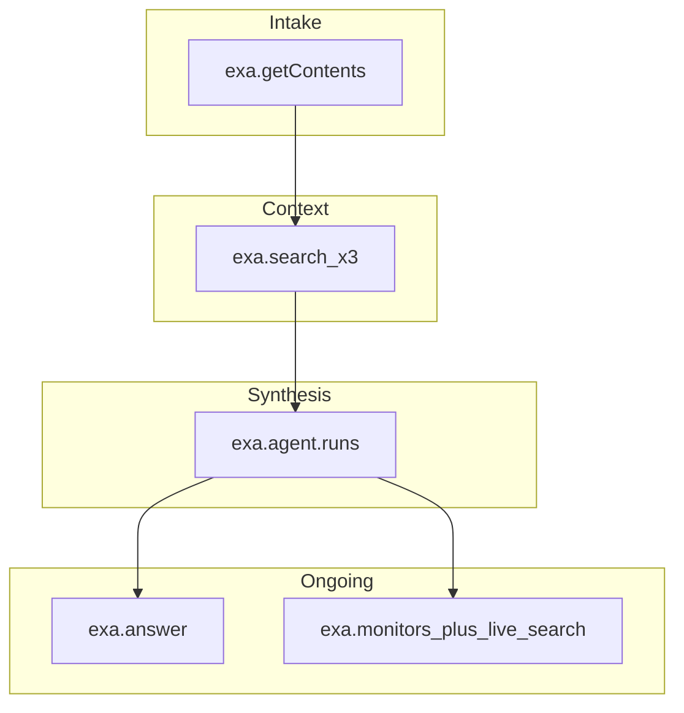

# Meridian Federal — why this use case matters

**Audience:** Exa Forward Deployed Engineer interview (also usable with a capture champion)  
**Customer:** Meridian Federal — ICAM / identity / Zero Trust integrator  
**End user:** Capture manager who already has a SAM.gov notice URL  
**Product lens:** CaptureBrief — Exa-backed Pursue / Hold / Pass desk  

Paste each **On-slide** block into a slide. Keep **Speaker notes** for yourself. Tables and diagrams are meant to be rebuilt visually or screenshotted from a Mermaid renderer.

---

## Slide 1 — They don’t need more opportunities. They need fewer wasted pursuits.

### On-slide

**Headline**

Meridian Federal doesn’t need more opportunities.  
They need fewer wasted pursuits.

**Subhead**

A capture manager already has the notice. The job is a defensible Pursue / Hold / Pass — before the team burns proposal hours.

**Customer vignette (keep short)**

> “Army just posted an ICAM Sources Sought. Is identity core scope? Can we access the vehicle? Is the window even open? I have until Thursday’s gate review.”

**Table — Today vs cost of being wrong**

| Failure mode | What happens today | Cost to Meridian |
| --- | --- | --- |
| Dead / inactive notice | Status checked late, after research already started | 4–20 capture hours burned |
| Identity is incidental | “Access control” turns out to be door hardware or a one-line ask | Wrong pursuit on the board |
| No contract access | Vehicle / set-aside discovered after BD commit | Scramble teaming or quiet kill |
| Weak citations | “Chat said so” in the Thursday review | Decision gets challenged; trust dies |
| Missed amendment | Deadline or attachment changes in email noise | Late no-bid or non-compliant response |

**One line under the table**

Google returns pages to read. Meridian needs records already checked.

### Diagram (paste into Mermaid or redraw)

### Speaker notes

- Open with the customer, not Exa. Meridian’s capture lead is not failing at “search.” They are failing at **throughput of judgment**.
- Federal identity work is high-ACV and research-heavy: notice text, Zero Trust strategy, budget justification, prior awards, vehicle path.
- The painful part is false starts — especially inactive notices and mis-scoped “access” language.
- Do **not** pitch discovery/shortlist here. Their workflow starts from a URL they already trust enough to open.
- Transition: “So what does a good Monday look like for that person?”

---

## Slide 2 — The job: Pursue / Hold / Pass with hard gates

### On-slide

**Headline**

The use case is not “find RFPs.”  
It is: decide, defend, and keep watching.

**Job to be done**

Paste a known notice → retrieve official evidence → research agency/acquisition context → apply hard gates → human decides Pursue / Hold / Pass → watch for material changes.

**Hard gates Meridian actually uses**

| Gate | Hard? | Question the capture lead must answer |
| --- | --- | --- |
| Identity is core scope | Yes | Is ICAM / IAM / MFA / PAM / Zero Trust identity a primary deliverable? |
| Contract access | Yes | Can we reach the vehicle / set-aside directly or via named teaming? |
| Compliance attainable | Yes | Clearance, FedRAMP, CMMC — held or realistically attainable? |
| Opportunity actionable | Yes | Is the notice active with enough time for a deliberate decision? |
| Strategic alignment | No | Does it fit Meridian’s reusable ICAM growth path? |

**Trust line (on slide, large)**

AI never auto-bids.  
A blocked inactive notice is a win — not a failed demo.

### Diagram (paste into Mermaid or redraw)

**Optional mini-table under diagram**

| Decision | What “good” looks like for Meridian |
| --- | --- |
| Pursue | Handoff packet + live watch for amendments |
| Hold | Unresolved gates pinned; watch stays on |
| Pass | No-bid disposition with citations — hours protected |

### Speaker notes

- This slide is the product thesis. Emphasize **gates + human decision**.
- Call out the golden-path Army ICAM notice: inactive → Opportunity actionable fails → readiness blocked. That is CaptureBrief doing its job.
- Hard gates mirror how BD leadership already argues; software just forces evidence and consistency.
- Strategic alignment is soft on purpose — you can love the mission and still Pass on window/access.
- Transition: “Why does this need Exa instead of another LLM wrapper on SAM?”

---

## Slide 3 — Why Exa makes this real for Meridian

### On-slide

**Headline**

Exa turns a notice URL into a capture desk — not a chat summary.

**Capability map**

| Meridian step | Exa primitive | What Meridian gets |
| --- | --- | --- |
| Confirm the notice | `contents` (+ `search` fallback) | Live official fields from SAM.gov |
| Surrounding context | `search` × strategy / budget / acquisition | CISA, budget, awards — cited |
| Defensible brief | `agent` + output schema | Gates, unknowns, next actions |
| Quick clarification | `answer` | Grounded Q&A without re-running everything |
| After the decision | `monitors` + live `search` checks | Amendments, deadlines, attachments |

**Before / after for the capture lead**

| | Monday without Exa | Monday with CaptureBrief |
| --- | --- | --- |
| Time to first judgment | Half-day of tabs and PDFs | Minutes to a gated case |
| Dead notice | Often discovered late | Hard-blocked with official evidence |
| Thursday review | Opinions + scattered links | Cited packet + clear Pass/Hold/Pursue |
| After decision | Hope someone watches SAM | Continuous change feed on the pursuit |

**Close line**

This is a design-partner wedge for federal identity capture —  
not “AI that finds RFPs.”

### Diagram (paste into Mermaid or redraw)

### Speaker notes

- Exa is load-bearing: crawl the notice, domain-scoped research, schema-constrained agent, grounded ask, then monitoring. A single chat model cannot own that loop cleanly.
- Mention honesty: if livecrawl is thin, Search fallback on sam.gov is a feature — and should be visible.
- Commercial framing for Exa interviewers: FDE work looks like this — sharp ICP, real workflow, trust constraints, multi-API orchestration.
- If asked about sellability: pilot metric = hours saved per notice + dead-ends blocked before BD spend; CRM export later; human still decides.
- End by going live: “I’ll paste the recommended Army ICAM notice. Watch Exa block an inactive opportunity, then show what Pass or Pursue actually files.”

---

## Appendix — 30-second verbal glue between slides

1. → 2: “So Meridian’s scarce resource isn’t opportunity flow. It’s clean judgment under time pressure.”  
2. → 3: “That workflow only works if retrieval, research, and monitoring are real — which is where Exa sits.”  
3. → demo: “Same customer, same notice, live Exa path.”

## Appendix — recommended demo notice (for the live follow-on)

`https://sam.gov/opp/887384ceab80465193079e1a6c477513/view`  

Army ICAM / dynamic access-control Sources Sought — often inactive.  
**Expected on-slide outcome to foreshadow:** readiness blocked on opportunity window = capture hours saved.
